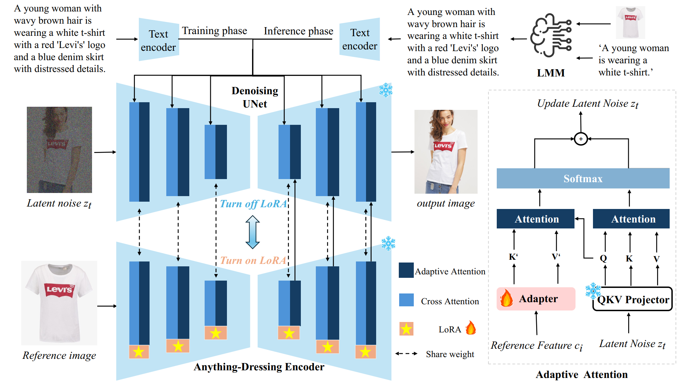
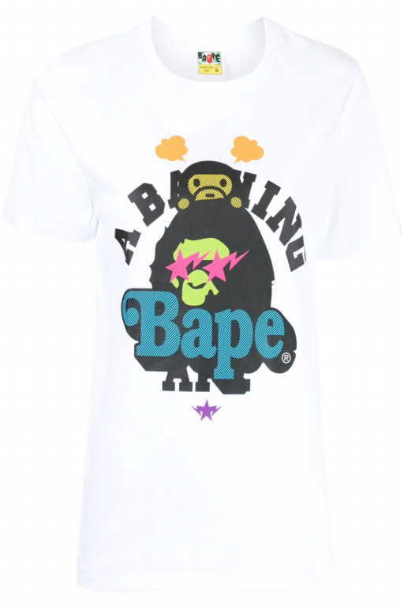
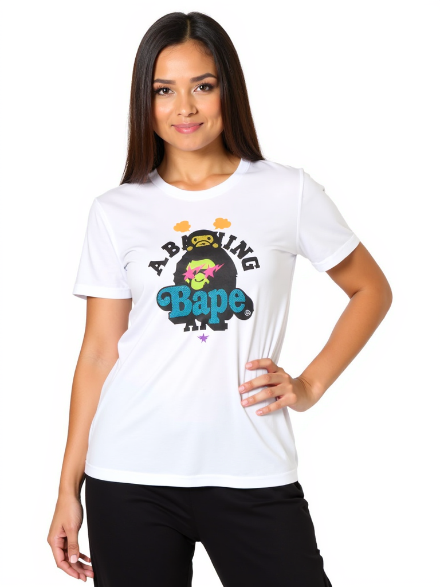
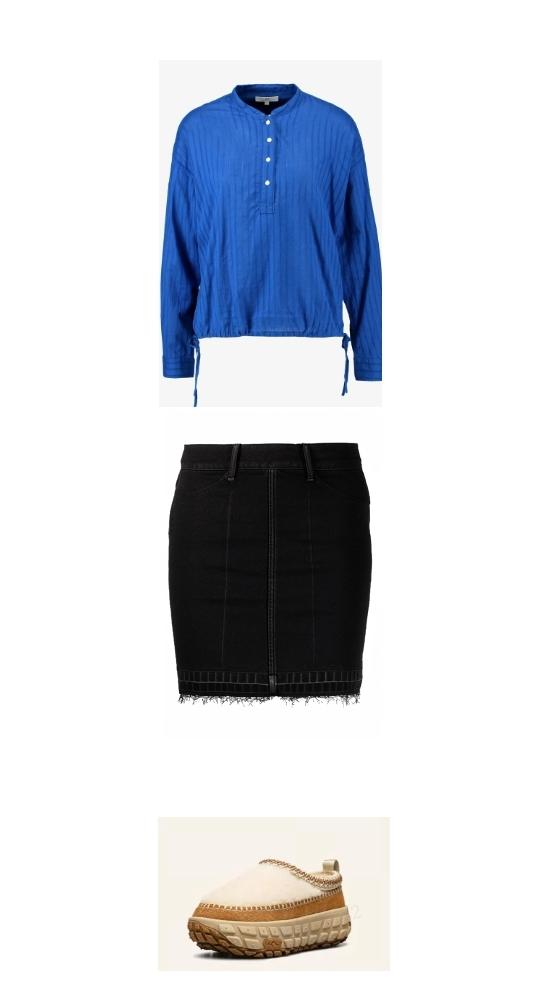
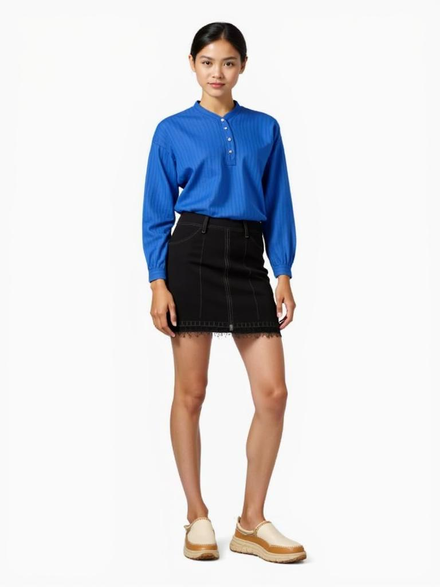
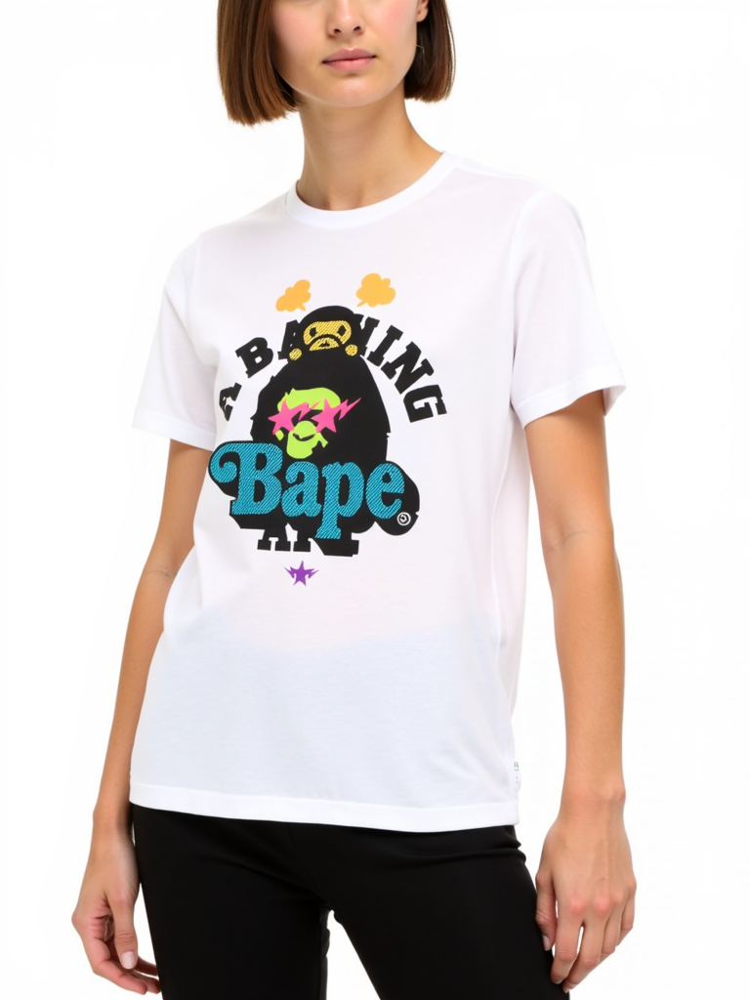
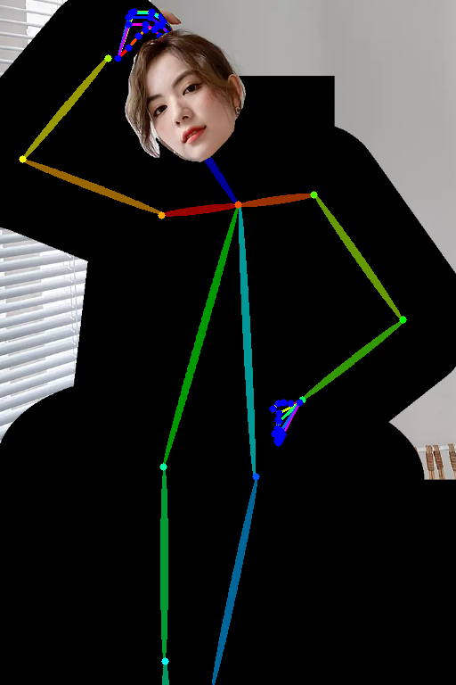
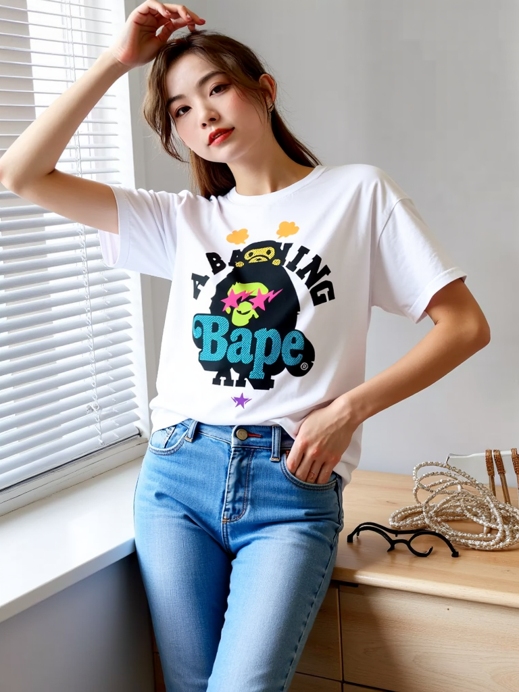

<div align="center">

  <h1 align="center">[AAAI2025] DreamFit: Garment-Centric Human Generation via a Lightweight Anything-Dressing Encoder</h1>

Ente Lin&dagger;, Xujie Zhang&dagger;, Fuwei Zhao, Yuxuan Luo, Xin Dong, Long Zeng*, Xiaodan Liang*


### [[`arxiv`](https://arxiv.org/abs/2412.17644)][[`Paper`](https://arxiv.org/pdf/2412.17644)]
</div>


## Abstract
<p>
    Diffusion models for garment-centric human generation from text or image prompts have garnered emerging attention for their great application potential. However, existing methods often face a dilemma: lightweight approaches, such as adapters, are prone to generate inconsistent textures; while finetune-based methods involve high training costs and struggle to maintain the generalization capabilities of pretrained diffusion models, limiting their performance across diverse scenarios. To address these challenges, we propose <strong>DreamFit</strong>, which incorporates a lightweight Anything-Dressing Encoder specifically tailored for the garment-centric human generation.
</p>
<p>
    DreamFit has three key advantages: 
</p>
<ol>
    <li><strong>Lightweight training</strong>: with the proposed adaptive attention and LoRA modules, DreamFit significantly minimizes the model complexity to 83.4M trainable parameters.</li>
    <li><strong>Anything-Dressing</strong>: Our model generalizes surprisingly well to a wide range of (non-)garments, creative styles, and prompt instructions, consistently delivering high-quality results across diverse scenarios.</li>
    <li><strong>Plug-and-play</strong>: DreamFit is engineered for smooth integration with any community control plugins for diffusion models, ensuring easy compatibility and minimizing adoption barriers.</li>
</ol>
<p>
    To further enhance generation quality, DreamFit leverages pretrained large multi-modal models (LMMs) to enrich the prompt with fine-grained garment descriptions, thereby reducing the prompt gap between training and inference. We conduct comprehensive experiments on both 768 × 512 high-resolution benchmarks and in-the-wild images. DreamFit surpasses all existing methods, highlighting its state-of-the-art capabilities of garment-centric human generation.
</p>

## Overview
<p align="center">

</p>

<p>
    Our method constructs an <strong>Anything-Dressing Encoder</strong> utilizing <strong>LoRA</strong> layers. The reference image features are extracted by the Anything-Dressing Encoder and then passed into the denoising <strong>UNet</strong> via adaptive attention. 
</p>
<p>
    Furthermore, we incorporate <strong>Large Multimodal Models (LMM)</strong> into the inference process to reduce the text prompt gap between the training and testing.
</p>


## Installation Guide
1. Clone our repo:
```bash
git clone https://github.com/bytedance/DreamFit.git
```
2. Create new virtual environment:
```bash
conda create -n dreamfit python==3.10
conda activate dreamfit
```
3. Install our dependencies by running the following command:
```bash
pip install -r requirements.txt
pip install flash-attn --no-build-isolation --use-pep517 
```

## Models
1. You can download the pretrained models [Here](https://huggingface.co/bytedance-research/Dreamfit). Download the checkpoint to `pretrained_models` folder.
2. If you want to inference with StableDiffusion1.5 version, you need to download the [stable-diffusion-v1-5](https://huggingface.co/stable-diffusion-v1-5/stable-diffusion-v1-5), [sd-vae-ft-mse](https://huggingface.co/stabilityai/sd-vae-ft-mse) to `pretrained_models`. If you want to generate images of different styles, you can download the corresponding stylized model, such as [RealisticVision](https://huggingface.co/SG161222/Realistic_Vision_V6.0_B1_noVAE), to `pretrained_models`.
3. If you want to inference with Flux version, you need to download the [flux-dev](https://huggingface.co/black-forest-labs/FLUX.1-dev) to `pretrained_models` folder
4. If you want to inference with pose control, you need to download the [Annotators](https://huggingface.co/lllyasviel/Annotators) to `pretrained_models` folder

The folder structures should look like these:

```
├── pretrained_models/
|   ├── flux_i2i_with_pose.bin
│   ├── flux_i2i.bin
│   ├── flux_tryon.bin
│   ├── sd15_i2i.ckpt
|   ├── stable-diffusion-v1-5/
|   |   ├── ...
|   ├── sd-vae-ft-mse/
|   |   ├── diffusion_pytorch_model.bin
|   |   ├── ...
|   ├── Realistic_Vision_V6.0_B1_noVAE(or other stylized model)/
|   |   ├── unet/
|   |   |   ├── diffusion_pytorch_model.bin
|   |   |   ├── ...
|   |   ├── ...
|   ├── Annotators/
|   |   ├── body_pose_model.pth
|   |   ├── facenet.pth
|   |   ├── hand_pose_model.pth
|   ├── FLUX.1-dev/
|   |   ├── flux1-dev.safetensors
|   |   ├── ae.safetensors
|   |   ├── tokenizer
|   |   ├── tokenizer_2
|   |   ├── text_encoder
|   |   ├── text_encoder_2
|   |   ├── ...
```

## Inference

### Garment-Centric Generation

``` bash
# inference with FLUX version
bash run_inference_dreamfit_flux_i2i.sh \
    --cloth_path example/cloth/cloth_1.png \
    --image_text "A woman wearing a white Bape T-shirt with a colorful ape graphic and bold text." \
    --save_dir "." \
    --seed 164143088151

# inference with StableDiffusion1.5 version
bash run_inference_dreamfit_sd15_i2i.sh \
    --cloth_path example/cloth/cloth_3.jpg\
    --image_text "A woman with curly hair wears a pink t-shirt with a logo and white stripes on the sleeves, paired with white trousers, against a plain white background."\
    --ref_scale 1.0 \
    --base_model pretrained_models/Realistic_Vision_V6.0_B1_noVAE/unet/diffusion_pytorch_model.bin \
    --base_model_load_method diffusers \
    --save_dir "." \
    --seed 28
```

Tips: 
1. If you have multiple pieces of clothing, you can splice them onto one picture, as shown in the second row.
2. Use `--help` to check the meaning of each argument.

<table style="width:100%; text-align:center;">
  <tr>
    <th style="text-align:center;">Image Text</th>
    <th style="text-align:center;">Cloth</th>
    <th style="text-align:center;">Output</th>
  </tr>
  <tr>
    <td style="text-align:center;">A woman wearing a white Bape T-shirt with a colorful ape graphic and bold text.</td>
    <td style="text-align:center;">
      
    </td>
    <td style="text-align:center;">
      
    </td>
  </tr>
  <tr>
    <td style="text-align:center;">A young woman with a casual yet stylish look, wearing a blue top, black skirt, and comfortable cream slip-on shoes.</td>
    <td style="text-align:center;">
      
    </td>
    <td style="text-align:center;">
      
    </td>
  </tr>
</table>

### Garment-Centric Generation with Pose Control

``` bash
bash run_inference_dreamfit_flux_i2i_with_pose.sh \
    --cloth_path example/cloth/cloth_1.png \
    --pose_path example/pose/pose_1.jpg \
    --image_text "A woman wearing a white Bape T-shirt with a colorful ape graphic and bold text." \
    --save_dir "." \
    --seed 16414308815
```

<table style="width:100%; text-align:center;">
  <tr>
    <th style="text-align:center;">Image Text</th>
    <th style="text-align:center;">Cloth</th>
    <th style="text-align:center;">Pose Image</th>
    <th style="text-align:center;">Output</th>
  </tr>
  <tr>
    <td style="text-align:center;">A woman wearing a white Bape T-shirt with a colorful ape graphic and bold text.</td>
    <td style="text-align:center;">
      
    </td>
    <td style="text-align:center;">
      
    </td>
    <td style="text-align:center;">
      
    </td>
  </tr>
</table>

### Tryon


``` bash
bash run_inference_dreamfit_flux_tryon.sh \
    --cloth_path example/cloth/cloth_1.png \
    --keep_image_path example/tryon/keep_image_4.png \
    --image_text "A woman wearing a white Bape T-shirt with a colorful ape graphic and bold text and a blue jeans." \
    --save_dir "." \
    --seed 16414308815
```

Tips: 
1. Keep image is obtained by drawing the openpose on the garment-agnostic region.
2. The generation code for keep image cannot be open-sourced for the time being. As an alternative, we have provided several keep images for testing.

<table style="width:100%; text-align:center;">
  <tr>
    <th style="text-align:center;">Image Text</th>
    <th style="text-align:center;">Cloth</th>
    <th style="text-align:center;">Keep Image</th>
    <th style="text-align:center;">Output</th>
  </tr>
  <tr>
    <td style="text-align:center;">A woman wearing a white Bape T-shirt with a colorful ape graphic and bold text and a blue jeans.</td>
    <td style="text-align:center;">
      
    </td>
    <td style="text-align:center;">
      
    </td>
    <td style="text-align:center;">
      
    </td>
  </tr>
</table>

## Disclaimer
Most images used in this repository are sourced from the Internet. These images are solely intended to demonstrate the capabilities of our research. If you have any concerns, please contact us, and we will promptly remove any inappropriate content.

This project aims to make a positive impact on the field of AI-driven image generation. Users are free to create images using this tool, but they must comply with local laws and use it responsibly. The developers do not assume any responsibility for potential misuse by users.

## Citation
```
@article{lin2024dreamfit,
  title={DreamFit: Garment-Centric Human Generation via a Lightweight Anything-Dressing Encoder},
  author={Lin, Ente and Zhang, Xujie and Zhao, Fuwei and Luo, Yuxuan and Dong, Xin and Zeng, Long and Liang, Xiaodan},
  journal={arXiv preprint arXiv:2412.17644},
  year={2024}
}
```

## Acknowledgements
Thanks to [x-flux](https://github.com/XLabs-AI/x-flux) and [Moore-AnimateAnyone](https://github.com/MooreThreads/Moore-AnimateAnyone/pulse) repositories, for their open research and exploration.

## Contact
If you have any comments or questions, please open a new issue or feel free to contact [Ente Lin](linet22@mails.tsinghua.edu.cn) and [Xin Dong](dongxin.1016@bytedance.com).